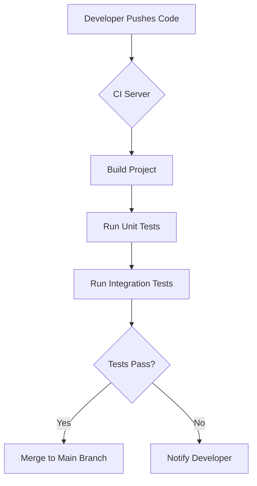
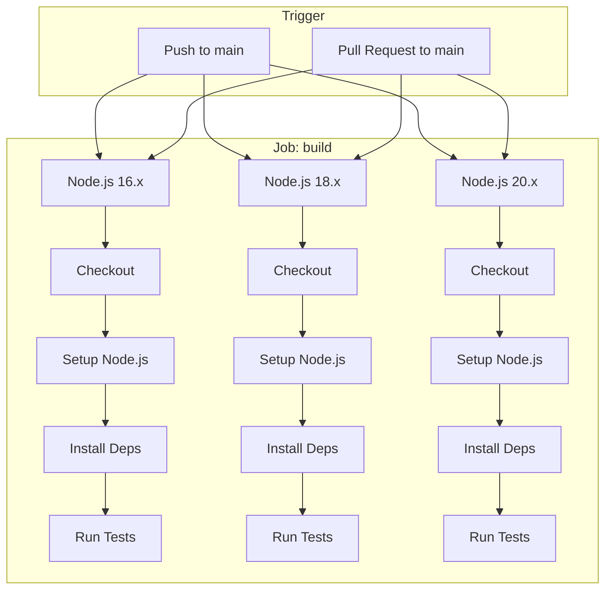
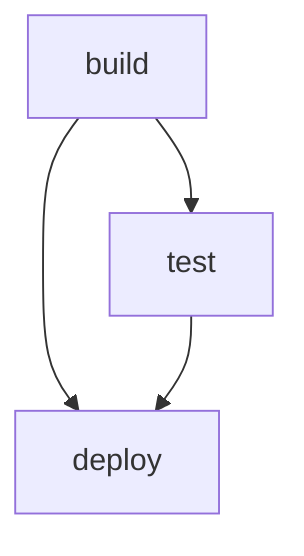

# A Comprehensive Guide to CI/CD with GitHub Actions

This document provides a deep dive into Continuous Integration (CI) and Continuous Deployment (CD) using GitHub Actions. It's designed for developers and DevOps engineers looking to build robust, secure, and efficient automated workflows.

## Table of Contents

1.  [Introduction to CI/CD and GitHub Actions](#1-introduction-to-cicd-and-github-actions)
    *   [What is Continuous Integration (CI)?](#what-is-continuous-integration-ci)
    *   [What is Continuous Deployment (CD)?](#what-is-continuous-deployment-cd)
    *   [What is Continuous Delivery?](#what-is-continuous-delivery)
    *   [Introducing GitHub Actions](#introducing-github-actions)
2.  [Core Concepts of GitHub Actions](#2-core-concepts-of-github-actions)
    *   [Workflows](#workflows)
    *   [Events](#events)
    *   [Jobs](#jobs)
    *   [Steps](#steps)
    *   [Actions](#actions)
    *   [Runners](#runners)
    *   [The GITHUB_TOKEN](#the-github_token)
3.  [Setting Up Your First GitHub Actions Workflow](#3-setting-up-your-first-github-actions-workflow)
    *   [Prerequisites](#prerequisites)
    *   [Creating the Workflow File](#creating-the-workflow-file)
    *   [A Simple Node.js CI Workflow](#a-simple-nodejs-ci-workflow)
    *   [Understanding the Workflow](#understanding-the-workflow)
    *   [Visualizing the Workflow](#visualizing-the-workflow)
4.  [A Deeper Dive into Workflow Syntax](#4-a-deeper-dive-into-workflow-syntax)
    *   [`name`](#name)
    *   [`on`](#on)
        *   [Multiple Events](#multiple-events)
        *   [Event Filters](#event-filters)
        *   [Scheduled Events](#scheduled-events)
        *   [Manual Triggers (`workflow_dispatch`)](#manual-triggers-workflow_dispatch)
    *   [`jobs`](#jobs)
        *   [Job Dependencies (`needs`)](#job-dependencies-needs)
        *   [Matrix Strategy (`strategy` and `matrix`)](#matrix-strategy-strategy-and-matrix)
    *   [`steps`](#steps-1)
        *   [`uses`](#uses)
        *   [`run`](#run)
        *   [`with`](#with)
        *   [`env`](#env)
5.  [Best Practices for CI with GitHub Actions](#5-best-practices-for-ci-with-github-actions)
    *   [Optimize for Speed and Efficiency](#optimize-for-speed-and-efficiency)
        *   [Caching Dependencies](#caching-dependencies)
        *   [Parallelizing Jobs](#parallelizing-jobs)
    *   [Ensure Code Quality](#ensure-code-quality)
        *   [Linting and Formatting](#linting-and-formatting)
        *   [Running Tests](#running-tests)
        *   [Code Coverage](#code-coverage)
    *   [Build and Package](#build-and-package)
        *   [Building a Docker Image](#building-a-docker-image)
        *   [Creating Artifacts](#creating-artifacts)
6.  [Best Practices for CD with GitHub Actions](#6-best-practices-for-cd-with-github-actions)
    *   [Deployment Environments](#deployment-environments)
    *   [Deployment Strategies](#deployment-strategies)
        *   [Direct Deployment](#direct-deployment)
        *   [Deploying to a Staging Environment](#deploying-to-a-staging-environment)
        *   [Manual Approvals for Production](#manual-approvals-for-production)
    *   [Managing Secrets](#managing-secrets)
7.  [Security Best Practices for GitHub Actions](#7-security-best-practices-for-github-actions)
    *   [Principle of Least Privilege](#principle-of-least-privilege)
    *   [Dependency Scanning](#dependency-scanning)
    *   [Static Application Security Testing (SAST)](#static-application-security-testing-sast)
    *   [Secret Scanning](#secret-scanning)
    *   [Using Self-Hosted Runners Securely](#using-self-hosted-runners-securely)
8.  [Advanced GitHub Actions Features](#8-advanced-github-actions-features)
    *   [Reusable Workflows](#reusable-workflows)
    *   [Custom Actions](#custom-actions)
    *   [GitHub Actions API](#github-actions-api)
9.  [Complex Workflow Example: Build, Test, and Deploy a Containerized App](#9-complex-workflow-example-build-test-and-deploy-a-containerized-app)
10. [Advanced Event Triggers](#10-advanced-event-triggers)
11. [Advanced Step Configuration](#11-advanced-step-configuration)
12. [Using Expressions](#12-using-expressions)
13. [Managing Secrets in-depth](#13-managing-secrets-in-depth)
14. [Creating Custom Actions](#14-creating-custom-actions)
15. [Self-Hosted Runners in Detail](#15-self-hosted-runners-in-detail)
16. [Troubleshooting Common Issues](#16-troubleshooting-common-issues)
17. [GitHub Actions API in-depth](#17-github-actions-api-in-depth)
18. [Conclusion](#18-conclusion)

---

## 1. Introduction to CI/CD and GitHub Actions

### What is Continuous Integration (CI)?

Continuous Integration is a software development practice where developers regularly merge their code changes into a central repository, after which automated builds and tests are run. The primary goals of CI are to find and address bugs quicker, improve software quality, and reduce the time it takes to validate and release new software updates.

**Key benefits of CI:**

*   **Early Bug Detection:** Frequent integration makes it easier to locate and fix bugs.
*   **Improved Collaboration:** Developers can work on different features in parallel with more confidence.
*   **Automated Testing:** Every change is automatically tested, ensuring a baseline of quality.
*   **Faster Iterations:** Automation speeds up the development cycle.



### What is Continuous Deployment (CD)?

Continuous Deployment is the next step after Continuous Integration. With CD, every change that passes all stages of your production pipeline is released to your customers. There's no human intervention, and only a failed test will prevent a new change to be deployed to production.

**Key benefits of CD:**

*   **Faster Releases:** Automating the release process means you can deploy new features and fixes to users in minutes.
*   **Reduced Risk:** Deploying smaller changes frequently reduces the impact of any single deployment.
*   **Happier Teams:** Developers are more confident in their ability to release software without manual overhead.

### What is Continuous Delivery?

Continuous Delivery is similar to Continuous Deployment, but with a manual approval step before the final deployment to production. This is often used when business or regulatory requirements necessitate a human gatekeeper.

### Introducing GitHub Actions

GitHub Actions is a CI/CD platform that allows you to automate your build, test, and deployment pipeline. You can create workflows that build and test every pull request to your repository or deploy merged pull requests to production.

GitHub Actions is not just for CI/CD. It can be used to automate any task in your software development lifecycle, such as:

*   Triaging and managing issues.
*   Automating releases and changelogs.
*   Sending notifications to Slack or other services.

---

## 2. Core Concepts of GitHub Actions

### Workflows

A workflow is an automated process that you define in your repository. You create a workflow by adding a YAML file to the `.github/workflows` directory in your repository. A repository can have multiple workflows, each of which can perform a different set of tasks.

### Events

An event is a specific activity that triggers a workflow run. For example, a workflow can be triggered when a developer pushes code to a branch, creates a pull request, or creates a new release. You can also trigger a workflow on a schedule or manually.

### Jobs

A job is a set of steps that execute on the same runner. Each job runs in its own virtual machine or container, and jobs run in parallel by default. You can also configure jobs to run sequentially by defining dependencies.

### Steps

A step is an individual task that can run commands in a job. A step can be a shell command, or it can be an *action*.

### Actions

Actions are standalone commands that are combined into *steps* to create a *job*. Actions are the smallest portable building block of a workflow. You can create your own actions, or you can use actions shared by the GitHub community.

### Runners

A runner is a server that has the GitHub Actions runner application installed. You can use runners hosted by GitHub, or you can host your own. GitHub-hosted runners are available for Linux, Windows, and macOS. Self-hosted runners give you more control over the hardware, operating system, and software tools than GitHub-hosted runners provide.

### The GITHUB_TOKEN

GitHub automatically creates a `GITHUB_TOKEN` secret to use in your workflow. You can use the `GITHUB_TOKEN` to authenticate in a workflow run. When you enable GitHub Actions, GitHub installs a GitHub App on your repository. The `GITHUB_TOKEN` secret is a GitHub App installation access token.

---

## 3. Setting Up Your First GitHub Actions Workflow

### Prerequisites

*   A GitHub repository.
*   A basic understanding of YAML syntax.
*   A sample application to build and test (we'll use a simple Node.js app).

### Creating the Workflow File

1.  Create a `.github/workflows` directory in the root of your repository.
2.  Inside this directory, create a new file named `ci.yml`.

### A Simple Node.js CI Workflow

```yaml
name: Node.js CI

on:
  push:
    branches: [ main ]
  pull_request:
    branches: [ main ]

jobs:
  build:
    runs-on: ubuntu-latest

    strategy:
      matrix:
        node-version: [16.x, 18.x, 20.x]

    steps:
    - name: Checkout repository
      uses: actions/checkout@v4

    - name: Use Node.js ${{ matrix.node-version }}
      uses: actions/setup-node@v3
      with:
        node-version: ${{ matrix.node-version }}
        cache: 'npm'

    - name: Install dependencies
      run: npm ci

    - name: Run tests
      run: npm test
```

### Understanding the Workflow

*   **`name: Node.js CI`**: The name of the workflow, which will be displayed on GitHub.
*   **`on: ...`**: This specifies the events that trigger the workflow. In this case, it's a `push` or `pull_request` to the `main` branch.
*   **`jobs: ...`**: This section defines the jobs to be run.
*   **`build:`**: The name of our job.
*   **`runs-on: ubuntu-latest`**: This specifies that the job should run on the latest version of Ubuntu provided by GitHub.
*   **`strategy: matrix: ...`**: This creates a build matrix. The workflow will run three times, once for each specified Node.js version.
*   **`steps: ...`**: This is the sequence of tasks to be executed.
    *   `actions/checkout@v4`: This is a pre-built action that checks out your repository's code into the runner.
    *   `actions/setup-node@v3`: This action sets up a specific version of Node.js.
    *   `npm ci`: This command installs the project dependencies. `ci` is generally faster and more reliable for CI environments than `npm install`.
    *   `npm test`: This command runs the tests.

### Visualizing the Workflow



---

## 4. A Deeper Dive into Workflow Syntax

### `name`

The name of your workflow. GitHub displays the names of your workflows on your repository's "Actions" tab. If you omit `name`, GitHub sets it to the workflow file path relative to the root of the repository.

### `on`

You can trigger a workflow to run on one or more events.

#### Multiple Events

```yaml
on: [push, pull_request]
```

#### Event Filters

You can filter events based on branches, tags, or paths.

```yaml
on:
  push:
    branches:
      - main
      - 'releases/**'
    paths:
      - 'src/**'
```

This workflow will only run on pushes to the `main` branch or any branch matching `releases/**`, and only if the changes are within the `src` directory.

#### Scheduled Events

You can schedule a workflow to run at specific UTC times using POSIX cron syntax.

```yaml
on:
  schedule:
    - cron: '30 5,17 * * *'
```

This workflow will run at 5:30 and 17:30 UTC every day.

#### Manual Triggers (`workflow_dispatch`)

You can trigger a workflow manually using the `workflow_dispatch` event. This will create a "Run workflow" button on the Actions tab in your repository.

```yaml
on:
  workflow_dispatch:
    inputs:
      logLevel:
        description: 'Log level'
        required: true
        default: 'warning'
        type: choice
        options:
        - info
        - warning
        - debug
```

### `jobs`

A workflow run is made up of one or more jobs.

#### Job Dependencies (`needs`)

You can use `needs` to create a dependency graph between your jobs.

```yaml
jobs:
  build:
    runs-on: ubuntu-latest
    steps:
      - run: echo "Building..."

  test:
    runs-on: ubuntu-latest
    needs: build
    steps:
      - run: echo "Testing..."

  deploy:
    runs-on: ubuntu-latest
    needs: [build, test]
    steps:
      - run: echo "Deploying..."
```

In this example, the `test` job will only start after the `build` job has successfully completed. The `deploy` job will only start after both `build` and `test` have completed successfully.



#### Matrix Strategy (`strategy` and `matrix`)

A matrix strategy lets you use variables in a single job definition to automatically create multiple job runs that are based on the combinations of the variables.

```yaml
jobs:
  test:
    runs-on: ${{ matrix.os }}
    strategy:
      matrix:
        os: [ubuntu-latest, windows-latest, macos-latest]
        python-version: ['3.8', '3.9', '3.10']
```

This will trigger 9 jobs, testing on all combinations of the specified operating systems and Python versions.

### `steps`

Each job contains a sequence of steps.

#### `uses`

Selects an action to run as part of a step in your job.

```yaml
steps:
- uses: actions/checkout@v4
```

#### `run`

Runs command-line programs using the operating system's shell.

```yaml
steps:
- run: npm install
```

#### `with`

A map of input parameters for an action.

```yaml
steps:
- uses: actions/setup-node@v3
  with:
    node-version: '18'
```

#### `env`

Sets environment variables for steps to use in the runner environment.

```yaml
steps:
- name: Set environment variable
  env:
    MY_VARIABLE: 'hello world'
  run: echo $MY_VARIABLE
```
---

## 5. Best Practices for CI with GitHub Actions

### Optimize for Speed and Efficiency

#### Caching Dependencies

Caching can significantly speed up your workflows by reusing files and dependencies from previous runs.

```yaml
jobs:
  build:
    runs-on: ubuntu-latest
    steps:
    - uses: actions/checkout@v4

    - name: Cache npm dependencies
      uses: actions/cache@v3
      with:
        path: ~/.npm
        key: ${{ runner.os }}-node-${{ hashFiles('**/package-lock.json') }}
        restore-keys: |
          ${{ runner.os }}-node-

    - name: Install dependencies
      run: npm ci
```

The `actions/setup-*` actions for various languages often have built-in caching support, which is even easier to use.

```yaml
    - name: Use Node.js
      uses: actions/setup-node@v3
      with:
        node-version: '18'
        cache: 'npm'
```

#### Parallelizing Jobs

If your tests are slow, you can split them into multiple jobs that run in parallel.

```yaml
jobs:
  test-unit:
    runs-on: ubuntu-latest
    steps:
      - run: echo "Running unit tests..."

  test-integration:
    runs-on: ubuntu-latest
    steps:
      - run: echo "Running integration tests..."

  test-e2e:
    runs-on: ubuntu-latest
    steps:
      - run: echo "Running end-to-end tests..."
```

These three jobs will run in parallel, giving you faster feedback.

### Ensure Code Quality

#### Linting and Formatting

Run a linter and code formatter on every push to ensure code consistency.

```yaml
jobs:
  lint:
    runs-on: ubuntu-latest
    steps:
      - uses: actions/checkout@v4
      - uses: actions/setup-node@v3
        with:
          node-version: 18
          cache: 'npm'
      - run: npm ci
      - run: npm run lint
      - run: npm run format-check
```

#### Running Tests

Of course, running automated tests is the cornerstone of CI.

```yaml
jobs:
  test:
    runs-on: ubuntu-latest
    steps:
      - uses: actions/checkout@v4
      - uses: actions/setup-node@v3
        with:
          node-version: 18
          cache: 'npm'
      - run: npm ci
      - run: npm test
```

#### Code Coverage

You can measure your test coverage and even enforce a minimum coverage percentage.

```yaml
jobs:
  test:
    runs-on: ubuntu-latest
    steps:
      - uses: actions/checkout@v4
      - uses: actions/setup-node@v3
        with:
          node-version: 18
          cache: 'npm'
      - run: npm ci
      - run: npm run test:coverage

      - name: Upload coverage to Codecov
        uses: codecov/codecov-action@v3
        with:
          token: ${{ secrets.CODECOV_TOKEN }}
```

### Build and Package

#### Building a Docker Image

You can build and push Docker images to a container registry.

```yaml
jobs:
  build-and-push-docker-image:
    runs-on: ubuntu-latest
    steps:
      - name: Checkout
        uses: actions/checkout@v4

      - name: Set up QEMU
        uses: docker/setup-qemu-action@v3

      - name: Set up Docker Buildx
        uses: docker/setup-buildx-action@v3

      - name: Login to Docker Hub
        uses: docker/login-action@v3
        with:
          username: ${{ secrets.DOCKERHUB_USERNAME }}
          password: ${{ secrets.DOCKERHUB_TOKEN }}

      - name: Build and push
        uses: docker/build-push-action@v5
        with:
          context: .
          push: true
          tags: your-username/your-app:latest
```

#### Creating Artifacts

You can use artifacts to share data between jobs in a workflow and to store data once a workflow is complete.

```yaml
jobs:
  build:
    runs-on: ubuntu-latest
    steps:
      - uses: actions/checkout@v4
      - run: npm install
      - run: npm run build

      - name: Upload artifact
        uses: actions/upload-artifact@v3
        with:
          name: build-output
          path: dist/

  deploy:
    runs-on: ubuntu-latest
    needs: build
    steps:
      - name: Download artifact
        uses: actions/download-artifact@v3
        with:
          name: build-output

      - run: ls -R
```

---

## 6. Best Practices for CD with GitHub Actions

### Deployment Environments

Use environments to describe a general deployment target like `production`, `staging`, or `development`. When a workflow deploys to an environment, the environment is displayed on the main page of the repository.

You can configure environments with protection rules and secrets. For example, you can require a manual approval before a job that deploys to `production` can proceed.

### Deployment Strategies

#### Direct Deployment

The simplest strategy is to deploy directly to your server on every push to `main`.

```yaml
jobs:
  deploy:
    runs-on: ubuntu-latest
    if: github.ref == 'refs/heads/main'
    steps:
      - name: Deploy to server
        uses: appleboy/ssh-action@master
        with:
          host: ${{ secrets.HOST }}
          username: ${{ secrets.USERNAME }}
          key: ${{ secrets.SSH_KEY }}
          script: |
            cd /var/www/myapp
            git pull origin main
            npm install
            npm run build
            pm2 restart myapp
```

#### Deploying to a Staging Environment

A better approach is to first deploy to a staging environment, run tests, and then deploy to production.

```yaml
jobs:
  deploy-staging:
    runs-on: ubuntu-latest
    environment: staging
    steps:
      - run: echo "Deploying to staging..."

  test-staging:
    runs-on: ubuntu-latest
    needs: deploy-staging
    steps:
      - run: echo "Testing on staging..."

  deploy-production:
    runs-on: ubuntu-latest
    needs: test-staging
    environment: production
    steps:
      - run: echo "Deploying to production..."
```

#### Manual Approvals for Production

You can require manual approval for deployments to sensitive environments like production.

In your repository settings, go to "Environments" and create a `production` environment. Add a protection rule that requires an approval from a specific team or user.

```yaml
jobs:
  deploy-production:
    runs-on: ubuntu-latest
    environment:
      name: production
      url: https://your-app.com
    steps:
      - run: echo "Deploying to production..."
```

Now, when the workflow reaches this job, it will pause and wait for an approval from one of the designated reviewers.

### Managing Secrets

Never hardcode secrets in your workflow files. Use GitHub's encrypted secrets to store sensitive information.

You can create secrets at the repository, organization, or environment level.

```yaml
steps:
  - name: Use a secret
    run: echo "The secret is ${{ secrets.MY_SECRET }}"
```

---

## 7. Security Best Practices for GitHub Actions

### Principle of Least Privilege

Grant only the permissions that a job needs. You can set default permissions for all jobs in a workflow, and then override them for specific jobs.

```yaml
permissions:
  actions: read
  contents: read
  deployments: write

jobs:
  read-only-job:
    runs-on: ubuntu-latest
    steps:
      - run: echo "I can only read."

  write-job:
    runs-on: ubuntu-latest
    permissions:
      contents: write
    steps:
      - run: echo "I can write to the repo."
```

### Dependency Scanning

Use tools like Dependabot to automatically find and fix vulnerable dependencies.

Enable Dependabot in your repository settings under "Security".

### Static Application Security Testing (SAST)

Use a SAST tool to analyze your code for security vulnerabilities. GitHub's own CodeQL is a powerful option.

```yaml
jobs:
  analyze:
    name: Analyze
    runs-on: ubuntu-latest
    permissions:
      actions: read
      contents: read
      security-events: write

    strategy:
      fail-fast: false
      matrix:
        language: [ 'javascript' ]

    steps:
    - name: Checkout repository
      uses: actions/checkout@v3

    - name: Initialize CodeQL
      uses: github/codeql-action/init@v2
      with:
        languages: ${{ matrix.language }}

    - name: Autobuild
      uses: github/codeql-action/autobuild@v2

    - name: Perform CodeQL Analysis
      uses: github/codeql-action/analyze@v2
```

### Secret Scanning

GitHub automatically scans repositories for known secret formats to prevent fraudulent use of accidentally committed secrets. You can also add custom patterns for your organization.

### Using Self-Hosted Runners Securely

Self-hosted runners can be a security risk if not managed properly.

*   Only use self-hosted runners in private repositories.
*   Implement a strategy to regularly update your self-hosted runners.
*   Harden the runner's environment and apply the principle of least privilege.

---

## 8. Advanced GitHub Actions Features

### Reusable Workflows

You can call one workflow from another, which is great for reducing duplication.

**`reusable-workflow.yml`**
```yaml
on:
  workflow_call:
    inputs:
      username:
        required: true
        type: string
    secrets:
      token:
        required: true

jobs:
  say-hello:
    runs-on: ubuntu-latest
    steps:
      - run: echo "Hello, ${{ inputs.username }}!"
```

**`main-workflow.yml`**
```yaml
jobs:
  greet:
    uses: ./.github/workflows/reusable-workflow.yml
    with:
      username: 'Mona'
    secrets:
      token: ${{ secrets.MY_TOKEN }}
```

### Custom Actions

You can create your own actions to encapsulate complex tasks. Actions can be written in JavaScript or as a Docker container.

### GitHub Actions API

The GitHub API provides endpoints for managing GitHub Actions, which allows you to build powerful integrations and tools.

---

## 9. Complex Workflow Example: Build, Test, and Deploy a Containerized App

This example shows a more realistic workflow that builds a Docker image, runs tests against it, pushes it to GitHub Container Registry, and deploys it to a (mock) server.

```yaml
name: CI/CD for Containerized App

on:
  push:
    branches:
      - main

jobs:
  build-and-test:
    runs-on: ubuntu-latest
    steps:
      - uses: actions/checkout@v4

      - name: Build the Docker image
        run: docker build . --tag my-app:${{ github.sha }}

      - name: Run tests
        run: docker run --rm my-app:${{ github.sha }} npm test

  push-to-registry:
    runs-on: ubuntu-latest
    needs: build-and-test
    permissions:
      contents: read
      packages: write
    steps:
      - uses: actions/checkout@v4

      - name: Log in to GitHub Container Registry
        uses: docker/login-action@v3
        with:
          registry: ghcr.io
          username: ${{ github.actor }}
          password: ${{ secrets.GITHUB_TOKEN }}

      - name: Build and push
        uses: docker/build-push-action@v5
        with:
          context: .
          push: true
          tags: ghcr.io/${{ github.repository }}:${{ github.sha }}

  deploy:
    runs-on: ubuntu-latest
    needs: push-to-registry
    environment: production
    steps:
      - name: Deploy to production
        run: echo "Deploying image ghcr.io/${{ github.repository }}:${{ github.sha }} to production..."
        # In a real-world scenario, this would involve SSHing into a server,
        # using a Kubernetes action, or calling a cloud provider's API.
```

## 10. Advanced Event Triggers

You can use `issue_comment` to trigger a workflow when a comment is added to an issue. This can be used to build "bots" that respond to commands.

```yaml
on:
  issue_comment:
    types: [created]

jobs:
  parse-command:
    runs-on: ubuntu-latest
    if: github.event.issue.pull_request && startsWith(github.event.comment.body, '/deploy')
    steps:
      - run: echo "A deploy command was issued."
```

## 11. Advanced Step Configuration

*   **`continue-on-error`**: Prevents a job from failing when a step fails.
*   **`timeout-minutes`**: The maximum number of minutes to let a step run.
*   **`outputs`**: Steps can have outputs that can be used by other steps in the same job.

```yaml
jobs:
  my-job:
    runs-on: ubuntu-latest
    steps:
      - id: step1
        run: echo "::set-output name=my_output::hello"
      - id: step2
        run: echo "The output of step1 was ${{ steps.step1.outputs.my_output }}"
```

## 12. Using Expressions

Expressions allow you to use logic in your workflow files. They are surrounded by `${{ ... }}`.

```yaml
if: ${{ contains(github.event.pull_request.labels.*.name, 'bug') }}
```

This condition checks if the pull request has a "bug" label.

## 13. Managing Secrets in-depth

*   **Environment Secrets**: Secrets can be scoped to a specific environment. This is useful for storing things like API keys for your production or staging servers.
*   **Organization Secrets**: You can create secrets at the organization level, which makes them available to all repositories in that organization.

## 14. Creating Custom Actions

You can create your own actions to reuse code in your workflows. A JavaScript action has a `action.yml` file that defines its metadata and a main JavaScript file that runs the action's logic.

**`action.yml`**
```yaml
name: 'My Custom Action'
description: 'Greets someone'
inputs:
  who-to-greet:
    description: 'Who to greet'
    required: true
    default: 'World'
outputs:
  time:
    description: 'The time of the greeting'
runs:
  using: 'node16'
  main: 'index.js'
```

**`index.js`**
```javascript
const core = require('@actions/core');
const github = require('@actions/github');

try {
  // `who-to-greet` input defined in action metadata file
  const nameToGreet = core.getInput('who-to-greet');
  console.log(`Hello ${nameToGreet}!`);
  const time = (new Date()).toTimeString();
  core.setOutput("time", time);
  // Get the JSON webhook payload for the event that triggered the workflow
  const payload = JSON.stringify(github.context.payload, undefined, 2)
  console.log(`The event payload: ${payload}`);
} catch (error) {
  core.setFailed(error.message);
}
```

## 15. Self-Hosted Runners in Detail

Setting up a self-hosted runner involves:
1.  Adding a new runner in your repository, organization, or enterprise settings.
2.  Installing the runner software on your own machine or server.
3.  Configuring and running the runner.

Self-hosted runners can be assigned labels, which you can use to target specific jobs to specific runners.

```yaml
jobs:
  my-job:
    runs-on: [self-hosted, my-label]
```

## 16. Troubleshooting Common Issues

*   **Workflow not triggering**: Check the `on` configuration and the branch/path filters. YAML syntax is also a common culprit. Use a YAML validator.
*   **Secrets not working**: Make sure you are using `secrets.MY_SECRET` and not `env.MY_SECRET`. Also, secrets are not passed to forked repositories' pull requests by default.
*   **"Permission denied" errors**: Check the permissions of the `GITHUB_TOKEN` or the user/key you are using. This is a common issue when pushing to a registry or another repository.
*   **Actions failing**: Check the action's documentation and the logs for any error messages. Pin your actions to a specific version to avoid breakages from updates.
*   **Job failing on `npm ci`**: This usually means your `package-lock.json` is out of sync with `package.json`. Run `npm install` locally and commit the changes to `package-lock.json`.
*   **"File not found"**: Remember that each job runs in a fresh environment. You need to use `actions/checkout` to get your code, and you may need to pass files between jobs using artifacts.

## 17. GitHub Actions API in-depth

The GitHub Actions API allows you to manage workflows, runs, and artifacts programmatically. This is useful for building custom dashboards, tools, or integrations.

You can use `curl` or any HTTP client to interact with the API. You'll need to authenticate with a personal access token or a GitHub App.

**Example: Triggering a workflow dispatch event**

```bash
curl -X POST \
  -H "Accept: application/vnd.github.v3+json" \
  -H "Authorization: token ${{ secrets.PERSONAL_ACCESS_TOKEN }}" \
  https://api.github.com/repos/OWNER/REPO/actions/workflows/WORKFLOW_ID/dispatches \
  -d '{"ref":"main"}'
```

**Example: Listing workflow runs**

```bash
curl \
  -H "Accept: application/vnd.github.v3+json" \
  -H "Authorization: token ${{ secrets.PERSONAL_ACCESS_TOKEN }}" \
  https://api.github.com/repos/OWNER/REPO/actions/runs
```

## 18. Conclusion

GitHub Actions is an incredibly powerful and flexible platform for CI/CD and automation. By following the best practices outlined in this guide, you can create fast, reliable, and secure workflows that will significantly improve your development lifecycle.

The key takeaways are:

*   Start with a simple CI workflow and iterate.
*   Cache dependencies and parallelize jobs for speed.
*   Use environments and manual approvals for safe deployments.
*   Prioritize security with least privilege, scanning, and secret management.
*   Embrace reusable workflows to keep your configuration DRY.

Happy automating!
