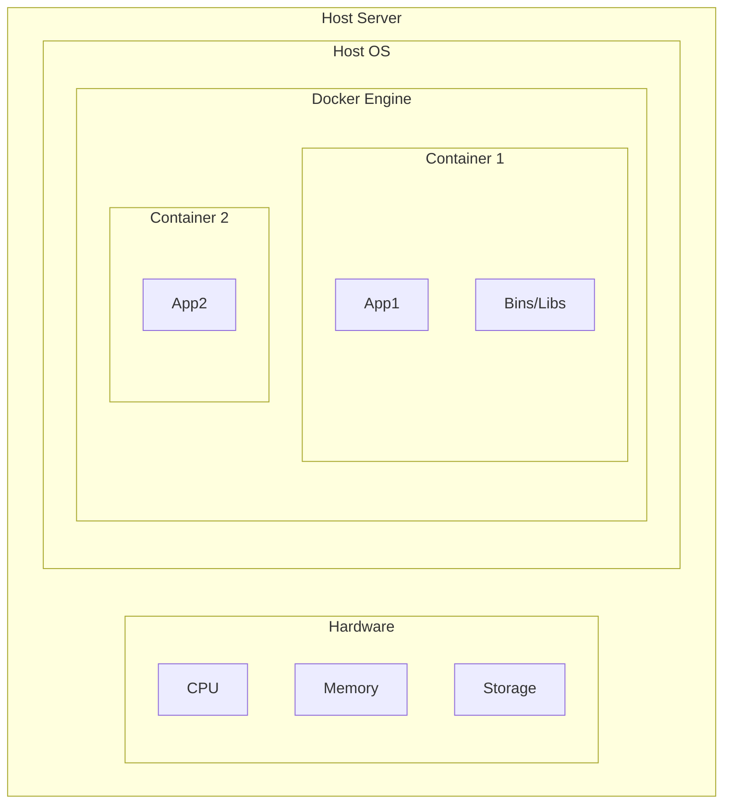

# A Comprehensive Guide to Docker Basics

This document provides a deep dive into the world of Docker. It is intended for beginners who want to understand what Docker is, how it works, and how to use it. By the end of this guide, you will be able to containerize your own applications and manage them with Docker.

## Table of Contents

1.  [Introduction to Docker](#1-introduction-to-docker)
    *   [What is Docker?](#what-is-docker)
    *   [Why Use Docker? The Problems it Solves](#why-use-docker-the-problems-it-solves)
    *   [Containers vs. Virtual Machines](#containers-vs-virtual-machines)
2.  [Docker Architecture](#2-docker-architecture)
    *   [The Docker Daemon](#the-docker-daemon)
    *   [The Docker Client](#the-docker-client)
    *   [Docker Images](#docker-images)
    *   [Docker Containers](#docker-containers)
    *   [Docker Registries](#docker-registries)
3.  [Installing Docker](#3-installing-docker)
    *   [Installing Docker on macOS](#installing-docker-on-macos)
    *   [Installing Docker on Windows](#installing-docker-on-windows)
    *   [Installing Docker on Linux (Ubuntu)](#installing-docker-on-linux-ubuntu)
4.  [Core Docker Concepts in Depth](#4-core-docker-concepts-in-depth)
    *   [Docker Images in Detail](#docker-images-in-detail)
    *   [The Dockerfile: Building Images](#the-dockerfile-building-images)
    *   [Docker Containers in Detail](#docker-containers-in-detail)
    *   [Docker Volumes: Persisting Data](#docker-volumes-persisting-data)
    *   [Docker Networking](#docker-networking)
5.  [The Docker CLI in Practice](#5-the-docker-cli-in-practice)
    *   [Image Commands](#image-commands)
    *   [Container Commands](#container-commands)
    *   [Network Commands](#network-commands)
    *   [Volume Commands](#volume-commands)
    *   [System Commands](#system-commands)
6.  [Docker Compose: Multi-Container Applications](#6-docker-compose-multi-container-applications)
    *   [What is Docker Compose?](#what-is-docker-compose)
    *   [A Docker Compose Example](#a-docker-compose-example)
    *   [Docker Compose Commands](#docker-compose-commands)
7.  [Best Practices](#7-best-practices)
    *   [Dockerfile Best Practices](#dockerfile-best-practices)
    *   [Image Best Practices](#image-best-practices)
    *   [Container Best Practices](#container-best-practices)
8.  [Troubleshooting Common Docker Issues](#8-troubleshooting-common-docker-issues)
9.  [Conclusion](#9-conclusion)

---

## 1. Introduction to Docker

### What is Docker?

Docker is an open-source platform that enables developers to build, ship, and run applications in a loosely isolated environment called a container. By containerizing an application and its dependencies, Docker ensures that it works seamlessly in any environment.

### Why Use Docker? The Problems it Solves

Docker addresses several common challenges in software development and operations:

*   **"It works on my machine" problem:** Docker eliminates this by providing a consistent environment for an application from development to production.
*   **Dependency hell:** Docker containers package up all dependencies, so you don't have to worry about conflicts with other applications on the same server.
*   **Slow, cumbersome deployments:** Docker's lightweight containers can be started and stopped in seconds, making deployments faster and more efficient.
*   **Resource inefficiency:** Containers have much lower overhead than virtual machines, so you can run more containers on a single server.

### Containers vs. Virtual Machines

| Feature            | Containers                                       | Virtual Machines (VMs)                               |
| ------------------ | ------------------------------------------------ | ---------------------------------------------------- |
| **Isolation**      | Process-level isolation                          | Full hardware virtualization                         |
| **Operating System** | Share the host OS kernel                         | Each VM has its own guest OS                         |
| **Size**           | Lightweight (megabytes)                          | Heavyweight (gigabytes)                              |
| **Startup Time**   | Seconds                                          | Minutes                                              |
| **Resource Usage** | Low                                              | High                                                 |
| **Performance**    | Near-native                                      | Slower due to overhead                               |



```mermaid
graph TD
    subgraph Host Server
        subgraph Hardware
            CPU
            Memory
            Storage
        end
        subgraph Hypervisor
            subgraph VM 1
                Guest OS 1
                App1
                Bins/Libs
            end
            subgraph VM 2
                Guest OS 2
                App2
                Bins/Libs
            end
        end
    end
```

---
## 2. Docker Architecture

### The Docker Daemon

The Docker daemon (`dockerd`) is a persistent background process that manages Docker objects such as images, containers, networks, and volumes. The daemon listens for API requests from the Docker client and processes them.

### The Docker Client

The Docker client (`docker`) is the command-line tool that allows you to interact with the Docker daemon. When you run a command like `docker run`, the client sends a request to the daemon, which then carries out the command.

### Docker Images

A Docker image is a read-only template with instructions for creating a Docker container. An image is built from a `Dockerfile`. Images are composed of layers, and each layer represents an instruction in the `Dockerfile`.

### Docker Containers

A container is a runnable instance of an image. You can create, start, stop, move, or delete a container using the Docker API or CLI. A container is defined by its image and any configuration options you provide to it at creation.

### Docker Registries

A Docker registry is a storage and distribution system for Docker images. Docker Hub is the default public registry that Docker is configured to use, but you can also run your own private registry.

---
## 3. Installing Docker

### Installing Docker on macOS

1.  Download Docker Desktop for Mac from the [Docker Hub](https://hub.docker.com/editions/community/docker-ce-desktop-mac).
2.  Double-click the `.dmg` file to open the installer, then drag the Docker icon to the Applications folder.
3.  Start Docker from the Applications folder.
4.  Verify the installation by opening a terminal and running `docker --version`. You should see the Docker version information.
5.  Run the `hello-world` container to confirm that Docker is working correctly: `docker run hello-world`.

### Installing Docker on Windows

1.  Download Docker Desktop for Windows from the [Docker Hub](https://hub.docker.com/editions/community/docker-ce-desktop-windows).
2.  Double-click the `.exe` file to run the installer.
3.  Follow the instructions in the installation wizard. Ensure you enable the WSL 2 feature if prompted.
4.  After installation, start Docker Desktop.
5.  Verify the installation by opening a command prompt or PowerShell and running `docker --version`.
6.  Run the `hello-world` container: `docker run hello-world`.

### Installing Docker on Linux (Ubuntu)

```bash
# 1. Update the apt package index and install prerequisites
sudo apt-get update
sudo apt-get install -y \
    ca-certificates \
    curl \
    gnupg \
    lsb-release

# 2. Add Docker's official GPG key
sudo mkdir -p /etc/apt/keyrings
curl -fsSL https://download.docker.com/linux/ubuntu/gpg | sudo gpg --dearmor -o /etc/apt/keyrings/docker.gpg

# 3. Set up the repository
echo \
  "deb [arch=$(dpkg --print-architecture) signed-by=/etc/apt/keyrings/docker.gpg] https://download.docker.com/linux/ubuntu \
  $(lsb_release -cs) stable" | sudo tee /etc/apt/sources.list.d/docker.list > /dev/null

# 4. Install Docker Engine
sudo apt-get update
sudo apt-get install -y docker-ce docker-ce-cli containerd.io docker-compose-plugin

# 5. Add your user to the "docker" group to run docker commands without sudo
sudo usermod -aG docker $USER
newgrp docker # Activate the changes to groups

# 6. Verify that Docker Engine is installed correctly
docker run hello-world
```
---
## 4. Core Docker Concepts in Depth

### Docker Images in Detail

Images are built in layers. Each instruction in a `Dockerfile` creates a new layer. This layering system is what makes Docker so efficient. When you change a `Dockerfile`, Docker only rebuilds the layers that have changed.

You can find pre-built images on [Docker Hub](https://hub.docker.com/). It's a good practice to use official images as a base for your own images. Official images are vetted for security and follow best practices.

### The Dockerfile: Building Images

A `Dockerfile` is a text document that contains all the commands a user could call on the command line to assemble an image.

**Common `Dockerfile` Instructions:**

*   **`FROM`**: Specifies the base image for the new image. `FROM ubuntu:22.04`
*   **`WORKDIR`**: Sets the working directory for any `RUN`, `CMD`, `ENTRYPOINT`, `COPY`, and `ADD` instructions. `WORKDIR /app`
*   **`COPY`**: Copies files and directories from the build context to the filesystem of the image. `COPY . .`
*   **`RUN`**: Executes any commands in a new layer on top of the current image and commits the results. `RUN apt-get update && apt-get install -y python3`
*   **`CMD`**: Provides defaults for an executing container. There can only be one `CMD` instruction in a `Dockerfile`. `CMD ["python3", "app.py"]`
*   **`ENTRYPOINT`**: Configures a container that will run as an executable. `ENTRYPOINT ["/usr/sbin/nginx"]`
*   **`EXPOSE`**: Informs Docker that the container listens on the specified network ports at runtime. `EXPOSE 80`
*   **`ENV`**: Sets environment variables. `ENV APP_VERSION=1.0`
*   **`ARG`**: Defines a build-time variable. `ARG BUILD_VERSION`

**Example `Dockerfile` for a Node.js application:**

```dockerfile
# Stage 1: Build the application
FROM node:18-alpine AS builder

WORKDIR /app

COPY package*.json ./
RUN npm ci

COPY . .
RUN npm run build

# Stage 2: Create the production image
FROM node:18-alpine

WORKDIR /app

COPY --from=builder /app/package*.json ./
RUN npm ci --only=production

COPY --from=builder /app/dist ./dist

# Set a non-root user
USER node

EXPOSE 3000

CMD [ "node", "dist/index.js" ]
```

### Docker Containers in Detail

A container's lifecycle is managed by the Docker daemon.

*   `docker create my-image`: Creates a new container from an image but does not start it.
*   `docker run my-image`: Creates a new container and starts it.
*   `docker start my-container`: Starts one or more stopped containers.
*   `docker stop my-container`: Stops one or more running containers.
*   `docker restart my-container`: Restarts one or more containers.
*   `docker rm my-container`: Removes one or more containers.
*   `docker kill my-container`: Kills one or more running containers.
*   `docker pause my-container`: Pauses all processes within one or more containers.
*   `docker unpause my-container`: Unpauses all processes within one or more containers.

### Docker Volumes: Persisting Data

By default, all files created inside a container are stored on a writable container layer. This means that the data doesn't persist when the container is deleted. Docker volumes are the preferred mechanism for persisting data generated by and used by Docker containers.

**Creating and using a volume:**

```bash
# Create a volume
docker volume create my-data

# Run a container and mount the volume
docker run -d --name my-container -v my-data:/app/data my-image

# Inspect the volume to see where it's stored on the host
docker volume inspect my-data
```

### Docker Networking

Docker's networking subsystem is pluggable, using drivers. Several drivers exist by default and provide core networking functionality.

*   **`bridge`**: The default network driver. If you don't specify a driver, this is the type of network you are creating.
*   **`host`**: For standalone containers, remove network isolation between the container and the Docker host, and use the host's networking directly.
*   **`overlay`**: Overlay networks connect multiple Docker daemons together and enable swarm services to communicate with each other.
*   **`macvlan`**: Macvlan networks allow you to assign a MAC address to a container, making it appear as a physical device on your network.
*   **`none`**: For this container, disable all networking.

**Creating and using a custom bridge network:**

```bash
# Create a network
docker network create my-app-net

# Run a database container on the network
docker run -d \
  --name db \
  --network my-app-net \
  -e POSTGRES_PASSWORD=mysecretpassword \
  postgres

# Run an application container on the network
docker run -d \
  --name my-app \
  --network my-app-net \
  -e DATABASE_HOST=db \
  my-app-image
```

Containers on the `my-app-net` network can communicate with each other by their container names. `my-app` can connect to the database at `db:5432`.
---
## 5. The Docker CLI in Practice

### Image Commands

*   `docker images`: List all images on your local machine.
*   `docker pull nginx:latest`: Pull the latest `nginx` image from Docker Hub.
*   `docker push my-username/my-image:1.0`: Push an image to a registry.
*   `docker build -t my-app:1.0 .`: Build an image from the `Dockerfile` in the current directory.
*   `docker rmi my-app:1.0`: Remove an image.
*   `docker tag my-app:1.0 my-username/my-app:1.0`: Tag an image.
*   `docker history nginx:latest`: Show the history of an image, including its layers.
*   `docker inspect nginx:latest`: Get detailed information about an image in JSON format.

### Container Commands

*   `docker ps`: List running containers.
*   `docker ps -a`: List all containers (including stopped ones).
*   `docker run -d -p 8080:80 --name web-server nginx`: Run an Nginx container in detached mode, mapping port 8080 on the host to port 80 in the container.
*   `docker start web-server`: Start the `web-server` container.
*   `docker stop web-server`: Stop the `web-server` container.
*   `docker restart web-server`: Restart the `web-server` container.
*   `docker rm web-server`: Remove the `web-server` container (must be stopped first).
*   `docker rm -f web-server`: Force remove a running container.
*   `docker exec -it web-server bash`: Get an interactive shell inside the `web-server` container.
*   `docker logs web-server`: View the logs of the `web-server` container.
*   `docker logs -f web-server`: Follow the logs in real-time.
*   `docker inspect web-server`: Get detailed information about a container.

### Network Commands

*   `docker network ls`: List all networks.
*   `docker network create --driver bridge my-bridge-net`: Create a new bridge network.
*   `docker network rm my-bridge-net`: Remove a network.
*   `docker network inspect my-bridge-net`: See detailed information about a network.
*   `docker network connect my-bridge-net my-container`: Connect a container to a network.
*   `docker network disconnect my-bridge-net my-container`: Disconnect a container from a network.

### Volume Commands

*   `docker volume ls`: List all volumes.
*   `docker volume create my-data-volume`: Create a new volume.
*   `docker volume rm my-data-volume`: Remove a volume.
*   `docker volume inspect my-data-volume`: Get detailed information about a volume.
*   `docker volume prune`: Remove all unused local volumes.

### System Commands

*   `docker info`: Display system-wide information about your Docker installation.
*   `docker system df`: Show Docker disk usage.
*   `docker system prune`: Remove unused data (stopped containers, dangling images, unused networks, etc.).
*   `docker system prune -a --volumes`: Remove all unused images (not just dangling ones) and all unused volumes. **Use with caution!**
---
## 6. Docker Compose: Multi-Container Applications

### What is Docker Compose?

Docker Compose is a tool for defining and running multi-container Docker applications. With Compose, you use a YAML file to configure your application's services, networks, and volumes. Then, with a single command, you create and start all the services from your configuration.

### A Docker Compose Example

A `docker-compose.yml` file for a WordPress site might look like this:

```yaml
version: '3.8'

services:
  db:
    image: mysql:8.0
    container_name: mysql_db
    volumes:
      - db_data:/var/lib/mysql
    restart: always
    environment:
      MYSQL_ROOT_PASSWORD: my_root_password
      MYSQL_DATABASE: wordpress
      MYSQL_USER: wordpress_user
      MYSQL_PASSWORD: wordpress_password

  wordpress:
    image: wordpress:latest
    container_name: wordpress_site
    volumes:
      - ./wp-content:/var/www/html/wp-content
    ports:
      - "8000:80"
    restart: always
    environment:
      WORDPRESS_DB_HOST: db:3306
      WORDPRESS_DB_USER: wordpress_user
      WORDPRESS_DB_PASSWORD: wordpress_password
      WORDPRESS_DB_NAME: wordpress

volumes:
  db_data:
```

This Compose file defines two services: `db` and `wordpress`. The `wordpress` service depends on the `db` service. It also creates a named volume `db_data` for persisting the database data.

### Docker Compose Commands

*   `docker-compose up`: Create and start containers. Add `-d` to run in detached mode.
*   `docker-compose down`: Stop and remove containers, networks, and the default network. Add `--volumes` to also remove named volumes.
*   `docker-compose build`: Build or rebuild the images for your services.
*   `docker-compose ps`: List the containers for your services.
*   `docker-compose logs`: View the logs from your services.
*   `docker-compose logs -f <service_name>`: Follow the logs for a specific service.
*   `docker-compose exec <service_name> <command>`: Execute a command in a running container. `docker-compose exec wordpress bash`
---
## 7. Best Practices

### Dockerfile Best Practices

*   **Use a `.dockerignore` file:** Exclude files and directories that are not needed for the build (e.g., `node_modules`, `.git`, `.env`).
*   **Use multi-stage builds:** This helps to keep your final image small by separating the build environment from the runtime environment.
*   **Don't install unnecessary packages:** Only install what is absolutely necessary for your application to run.
*   **Sort multi-line arguments alphabetically:** This makes the Dockerfile more readable and helps to avoid duplication.
*   **Leverage build cache:** Order your `Dockerfile` instructions from least to most frequently changing to take advantage of Docker's build cache.
*   **Use a non-root user:** Running containers as a non-root user is a security best practice.

### Image Best Practices

*   **Use official images from Docker Hub:** They are regularly updated and scanned for vulnerabilities.
*   **Use specific image tags:** Avoid using the `latest` tag in production. Pin your images to a specific version (e.g., `node:18.12-alpine`).
*   **Scan your images for vulnerabilities:** Use tools like Snyk, Trivy, or Docker Scout to scan your images for known vulnerabilities.

### Container Best Practices

*   **Keep containers ephemeral:** Your containers should be stateless and disposable. Persist data in volumes.
*   **Use a logging driver:** Configure a logging driver to send your container logs to a centralized logging system (e.g., ELK, Splunk, Graylog).
*   **Set resource limits:** Use the `--memory` and `--cpus` flags with `docker run` to limit the resources a container can consume.

---

## 8. Troubleshooting Common Docker Issues

*   **"Cannot connect to the Docker daemon. Is the docker daemon running?"**: This means the Docker client cannot reach the Docker daemon. Make sure the Docker service is running (`sudo systemctl status docker`).
*   **"Bind for 0.0.0.0:80 failed: port is already allocated"**: A process on your host is already using the port you are trying to map. Use `sudo lsof -i :80` to find the process and stop it, or choose a different host port.
*   **"standard_init_linux.go:211: exec user process caused 'no such file or directory'"**: This is often due to incorrect line endings in a script inside the container (e.g., Windows-style CRLF instead of Unix-style LF). Run `dos2unix` on your scripts.
*   **Permission errors on volumes**: This is common when the user inside the container does not have permission to write to the mounted volume on the host. Ensure the user ID inside the container has write access to the host directory.

---
## 9. Conclusion

Docker is a powerful tool that can revolutionize your development and deployment workflows. By mastering the concepts in this guide, you are well on your way to becoming a proficient Docker user. The next steps in your journey could be learning about Docker Swarm for simple orchestration or diving into the more powerful and complex world of Kubernetes. Happy containerizing!
