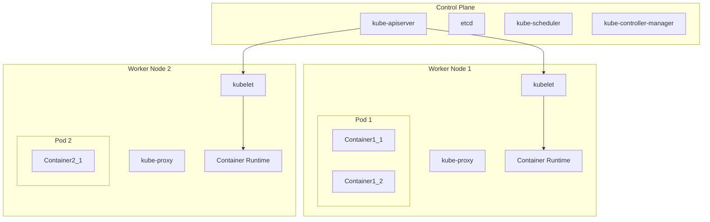

# An Introduction to Kubernetes

This document provides a comprehensive introduction to Kubernetes, the de-facto standard for container orchestration. It's designed for beginners who want to understand the fundamental concepts of Kubernetes and how to use it to manage containerized applications.

## Table of Contents

1.  [Introduction to Kubernetes](#1-introduction-to-kubernetes)
    *   [What is Kubernetes?](#what-is-kubernetes)
    *   [Why Use Kubernetes?](#why-use-kubernetes)
    *   [A Brief History of Kubernetes](#a-brief-history-of-kubernetes)
2.  [Kubernetes Architecture](#2-kubernetes-architecture)
    *   [The Control Plane (Master Node)](#the-control-plane-master-node)
    *   [Worker Nodes](#worker-nodes)
    *   [Visualizing the Architecture](#visualizing-the-architecture)
3.  [Core Kubernetes Concepts in Depth](#3-core-kubernetes-concepts-in-depth)
    *   [Pods](#pods)
    *   [Deployments](#deployments)
    *   [Services](#services)
    *   [ReplicaSets](#replicasets)
    *   [Namespaces](#namespaces)
    *   [Volumes](#volumes)
    *   [Jobs and CronJobs](#jobs-and-cronjobs)
    *   [ConfigMaps and Secrets](#configmaps-and-secrets)
    *   [StatefulSets](#statefulsets)
    *   [PersistentVolumes and PersistentVolumeClaims](#persistentvolumes-and-persistentvolumeclaims)
4.  [Networking in Kubernetes](#4-networking-in-kubernetes)
    *   [Pod-to-Pod Communication](#pod-to-pod-communication)
    *   [Services](#services-1)
    *   [Ingress](#ingress)
    *   [Network Policies](#network-policies)
5.  [Storage in Kubernetes](#5-storage-in-kubernetes)
    *   [PersistentVolumes](#persistentvolumes)
    *   [PersistentVolumeClaims](#persistentvolumeclaims)
    *   [StorageClasses](#storageclasses)
6.  [Advanced Scheduling in Kubernetes](#6-advanced-scheduling-in-kubernetes)
    *   [Taints and Tolerations](#taints-and-tolerations)
    *   [Node Affinity](#node-affinity)
7.  [`kubectl` - The Kubernetes CLI](#7-kubectl---the-kubernetes-cli)
    *   [Common `kubectl` Commands](#common-kubectl-commands)
    *   [Advanced `kubectl` Commands](#advanced-kubectl-commands)
8.  [YAML in Kubernetes](#8-yaml-in-kubernetes)
    *   [An Example YAML File](#an-example-yaml-file)
    *   [Dissecting the YAML](#dissecting-the-yaml)
9.  [Security in Kubernetes](#9-security-in-kubernetes)
    *   [Authentication](#authentication)
    *   [Authorization (RBAC)](#authorization-rbac)
    *   [Pod Security Standards](#pod-security-standards)
    *   [Network Policies](#network-policies-1)
10. [Monitoring and Logging](#10-monitoring-and-logging)
    *   [Monitoring](#monitoring)
    *   [Logging](#logging)
11. [Helm: The Kubernetes Package Manager](#11-helm-the-kubernetes-package-manager)
    *   [What is Helm?](#what-is-helm)
    *   [Helm Charts](#helm-charts)
    *   [Basic Helm Commands](#basic-helm-commands)
12. [Conclusion](#12-conclusion)

---

## 1. Introduction to Kubernetes

### What is Kubernetes?

Kubernetes, often abbreviated as K8s, is an open-source container orchestration platform that automates the deployment, scaling, and management of containerized applications. It groups containers that make up an application into logical units for easy management and discovery.

### Why Use Kubernetes?

Kubernetes provides several key benefits for managing containerized applications:

*   **High Availability:** Kubernetes can automatically restart containers that fail, replace and reschedule containers when nodes die, and only advertises containers to clients once they are ready to serve.
*   **Scalability:** You can scale your applications up or down with a simple command, or even automatically based on CPU usage.
*   **Portability:** Kubernetes works with a wide range of container runtimes and on-premises or cloud infrastructure, allowing you to move workloads without redesigning your applications.
*   **Self-healing:** Kubernetes constantly monitors the health of your containers and nodes, and can automatically replace failed containers.
*   **Service Discovery and Load Balancing:** Kubernetes can automatically expose a container using a DNS name or their own IP address. If traffic to a container is high, Kubernetes can load balance and distribute the network traffic so that the deployment is stable.

### A Brief History of Kubernetes

Kubernetes was originally developed by Google and was open-sourced in 2014. It is a descendant of Google's internal container orchestration system, Borg. Today, Kubernetes is maintained by the Cloud Native Computing Foundation (CNCF).

---

## 2. Kubernetes Architecture

A Kubernetes cluster consists of a set of worker machines, called nodes, that run containerized applications. Every cluster has at least one worker node. The worker node(s) host the Pods that are the components of the application workload. The control plane manages the worker nodes and the Pods in the cluster.

### The Control Plane (Master Node)

The control plane's components make global decisions about the cluster (for example, scheduling), as well as detecting and responding to cluster events.

Control plane components:

*   **`kube-apiserver`**: The API server is the front end for the Kubernetes control plane. It exposes the Kubernetes API.
*   **`etcd`**: A consistent and highly-available key-value store used as Kubernetes' backing store for all cluster data.
*   **`kube-scheduler`**: Watches for newly created Pods with no assigned node, and selects a node for them to run on.
*   **`kube-controller-manager`**: Runs controller processes.
*   **`cloud-controller-manager`**: Lets you link your cluster into your cloud provider's API.

### Worker Nodes

Worker nodes are the machines where your applications run.

Worker node components:

*   **`kubelet`**: An agent that runs on each node in the cluster. It makes sure that containers are running in a Pod.
*   **`kube-proxy`**: A network proxy that runs on each node in your cluster, implementing part of the Kubernetes Service concept.
*   **Container runtime**: The container runtime is the software that is responsible for running containers. Kubernetes supports several container runtimes: Docker, containerd, CRI-O, and any other implementation of the Kubernetes CRI (Container Runtime Interface).

### Visualizing the Architecture



---

## 3. Core Kubernetes Concepts in Depth

### Pods

A Pod is the smallest and simplest unit in the Kubernetes object model that you create or deploy. A Pod represents a running process on your cluster. A Pod can contain one or more containers, such as Docker containers. When a Pod runs multiple containers, the containers are managed as a single entity and share the Pod's resources, such as storage and networking.

### Deployments

A Deployment provides declarative updates for Pods and ReplicaSets. You describe a desired state in a Deployment, and the Deployment Controller changes the actual state to the desired state at a controlled rate. You can define Deployments to create new ReplicaSets, or to remove existing Deployments and adopt all their resources with new Deployments. Deployments are ideal for stateless applications.

### Services

A Service in Kubernetes is an abstraction which defines a logical set of Pods and a policy by which to access them. Services enable a loose coupling between dependent Pods. The set of Pods targeted by a Service is usually determined by a `selector`.

There are four types of Services:

*   **`ClusterIP`**: Exposes the Service on a cluster-internal IP. This is the default.
*   **`NodePort`**: Exposes the Service on each Node's IP at a static port.
*   **`LoadBalancer`**: Exposes the Service externally using a cloud provider's load balancer.
*   **`ExternalName`**: Maps the Service to the contents of the `externalName` field (e.g., `foo.bar.example.com`).

### ReplicaSets

A ReplicaSet's purpose is to maintain a stable set of replica Pods running at any given time. As such, it is often used to guarantee the availability of a specified number of identical Pods. You will usually not create ReplicaSets directly, but use Deployments instead.

### Namespaces

Namespaces provide a mechanism for isolating groups of resources within a single cluster. Names of resources need to be unique within a namespace, but not across namespaces. This is useful for multi-tenant environments.

### Volumes

A Volume is a directory, possibly with some data in it, which is accessible to the Containers in a Pod. A Kubernetes volume has an explicit lifetime the same as the Pod that encloses it. Consequently, a volume outlives any Containers that run within the Pod, and data is preserved across Container restarts.

### Jobs and CronJobs

*   **Job**: A Job creates one or more Pods and ensures that a specified number of them successfully terminate. Jobs are useful for running batch tasks.
*   **CronJob**: A CronJob creates Jobs on a repeating schedule.

### ConfigMaps and Secrets

*   **ConfigMap**: A ConfigMap is an API object used to store non-confidential data in key-value pairs. Pods can consume ConfigMaps as environment variables, command-line arguments, or as configuration files in a volume.
*   **Secret**: A Secret is an object that contains a small amount of sensitive data such as a password, a token, or a key.

### StatefulSets

StatefulSets are used to manage stateful applications. They provide guarantees about the ordering and uniqueness of Pods. This is in contrast to Deployments, where Pods are interchangeable. StatefulSets are useful for applications like databases that require stable, unique network identifiers and stable, persistent storage.

### PersistentVolumes and PersistentVolumeClaims

*   **PersistentVolume (PV)**: A piece of storage in the cluster that has been provisioned by an administrator. It is a resource in the cluster just like a node is a cluster resource.
*   **PersistentVolumeClaim (PVC)**: A request for storage by a user. It is similar to a Pod. Pods consume node resources and PVCs consume PV resources. Pods can request specific levels of performance (e.g., "fast") and PVCs can request specific storage classes.

---

## 4. Networking in Kubernetes

### Pod-to-Pod Communication

Every Pod in a Kubernetes cluster gets its own unique IP address. This means that you have a clean, flat networking model where Pods can communicate with each other directly, without needing to create explicit links.

### Services

As mentioned earlier, Services provide a stable endpoint for a set of Pods. They use a selector to find the Pods they should route traffic to. This provides a reliable way to access an application, even as the Pods that make up the application are created and destroyed.

### Ingress

An Ingress is an API object that manages external access to the services in a cluster, typically HTTP. Ingress can provide load balancing, SSL termination and name-based virtual hosting. An Ingress controller is responsible for fulfilling the Ingress, usually with a load balancer.

### Network Policies

Network Policies are an application-centric construct which allow you to specify how a pod is allowed to communicate with various network "entities" over the network. Network Policies can be used to create firewalls between pods.

---

## 5. Storage in Kubernetes

### PersistentVolumes

A PersistentVolume (PV) is a piece of storage in the cluster that has been provisioned by an administrator. It is a resource in the cluster just like a node is a cluster resource. PVs are volume plugins like Volumes, but have a lifecycle independent of any individual pod that uses the PV.

### PersistentVolumeClaims

A PersistentVolumeClaim (PVC) is a request for storage by a user. It is similar to a Pod. Pods consume node resources and PVCs consume PV resources. Pods can request specific levels of performance (e.g., "fast") and PVCs can request specific storage classes.

### StorageClasses

A StorageClass provides a way for administrators to describe the "classes" of storage they offer. Different classes might map to quality-of-service levels, or to backup policies, or to arbitrary policies determined by the cluster administrators.

---

## 6. Advanced Scheduling in Kubernetes

### Taints and Tolerations

Taints and tolerations work together to ensure that pods are not scheduled onto inappropriate nodes. A taint is applied to a node, and a toleration is applied to a pod. A pod with a toleration for a specific taint can be scheduled on a node with that taint.

### Node Affinity

Node affinity is a set of rules used by the scheduler to determine where a pod can be placed. The rules are defined using labels on nodes and selectors in pods.

---

## 7. `kubectl` - The Kubernetes CLI

`kubectl` is a command-line tool for controlling Kubernetes clusters.

### Common `kubectl` Commands

*   `kubectl get pods`: List all pods in the current namespace.
*   `kubectl get deployments`: List all deployments.
*   `kubectl get services`: List all services.
*   `kubectl describe pod <pod-name>`: Show detailed information about a pod.
*   `kubectl logs <pod-name>`: Print the logs for a pod.
*   `kubectl exec -it <pod-name> -- /bin/bash`: Get an interactive shell to a running container.
*   `kubectl apply -f <filename.yaml>`: Create or update a resource from a YAML file.
*   `kubectl delete -f <filename.yaml>`: Delete a resource defined in a YAML file.
*   `kubectl create namespace <namespace-name>`: Create a new namespace.
*   `kubectl config get-contexts`: Display the list of available contexts.
*   `kubectl config use-context <context-name>`: Switch to a different context.

### Advanced `kubectl` Commands

*   `kubectl scale deployment <deployment-name> --replicas=5`: Scale a deployment to 5 replicas.
*   `kubectl rollout status deployment/<deployment-name>`: Watch the status of a rolling update.
*   `kubectl rollout history deployment/<deployment-name>`: See the history of a deployment's rollouts.
*   `kubectl rollout undo deployment/<deployment-name>`: Rollback to a previous revision.

---

## 8. YAML in Kubernetes

Kubernetes objects can be created, updated, and deleted by using `kubectl` with a YAML file.

### An Example YAML File

This example YAML file creates a Deployment that runs two replicas of an Nginx web server, and a Service to expose it.

```yaml
apiVersion: apps/v1
kind: Deployment
metadata:
  name: nginx-deployment
  labels:
    app: nginx
spec:
  replicas: 2
  selector:
    matchLabels:
      app: nginx
  template:
    metadata:
      labels:
        app: nginx
    spec:
      containers:
      - name: nginx
        image: nginx:1.21.6
        ports:
        - containerPort: 80
---
apiVersion: v1
kind: Service
metadata:
  name: nginx-service
spec:
  selector:
    app: nginx
  ports:
    - protocol: TCP
      port: 80
      targetPort: 80
  type: NodePort
```

### Dissecting the YAML

*   **`apiVersion`**: Which version of the Kubernetes API you're using to create this object.
*   **`kind`**: What kind of object you want to create.
*   **`metadata`**: Data that helps uniquely identify the object, including a `name` string, `UID`, and optional `namespace`.
*   **`spec`**: What state you desire for the object.

---

## 9. Security in Kubernetes

### Authentication

Authentication in Kubernetes is the process of verifying the identity of a user or a service account. Kubernetes supports several authentication methods, such as client certificates, bearer tokens, and OpenID Connect.

### Authorization (RBAC)

Authorization is the process of verifying that a user or a service account has permission to perform a specific action on a specific resource. Kubernetes supports several authorization modules, with Role-Based Access Control (RBAC) being the most common. RBAC allows administrators to define roles with specific permissions and then bind those roles to users or service accounts.

### Pod Security Standards

Pod Security Standards define three policies (Privileged, Baseline, and Restricted) that you can apply to namespaces to control the security context of pods. These standards replace the deprecated PodSecurityPolicy.

### Network Policies

Network Policies provide a way to control the traffic between pods. By default, all pods in a cluster can communicate with each other. Network Policies allow you to restrict this traffic, creating a more secure environment.

---

## 10. Monitoring and Logging

### Monitoring

Monitoring is crucial for understanding the health and performance of your applications and cluster. The most popular monitoring solution for Kubernetes is Prometheus, an open-source monitoring and alerting toolkit. Prometheus scrapes metrics from your applications and cluster components and stores them in a time-series database.

### Logging

Logging provides insight into the behavior of your applications. The most common logging pattern in Kubernetes is to have your applications write logs to standard output and standard error. The container runtime redirects these streams to a logging driver. A common logging stack is the EFK stack (Elasticsearch, Fluentd, and Kibana).

---

## 11. Helm: The Kubernetes Package Manager

### What is Helm?

Helm is a tool that streamlines installing and managing Kubernetes applications. Think of it like `apt` or `yum` for Kubernetes. Helm helps you manage Kubernetes applications — Helm Charts — even the most complex ones.

### Helm Charts

Helm uses a packaging format called charts. A chart is a collection of files that describe a related set of Kubernetes resources. A single chart might be used to deploy something simple, like a memcached pod, or something complex, like a full web app stack with HTTP servers, databases, caches, and so on.

### Basic Helm Commands

*   `helm search hub <keyword>`: Search for charts in the Artifact Hub.
*   `helm install <release-name> <chart-name>`: Install a chart.
*   `helm list`: List all releases in the current namespace.
*   `helm uninstall <release-name>`: Uninstall a release.

---

## 12. Conclusion

Kubernetes is a powerful and flexible platform for managing containerized applications. This document has provided an introduction to its core concepts and components. To continue your learning journey, you can explore more advanced topics such as Helm for package management, Prometheus for monitoring, and Istio for service mesh.
