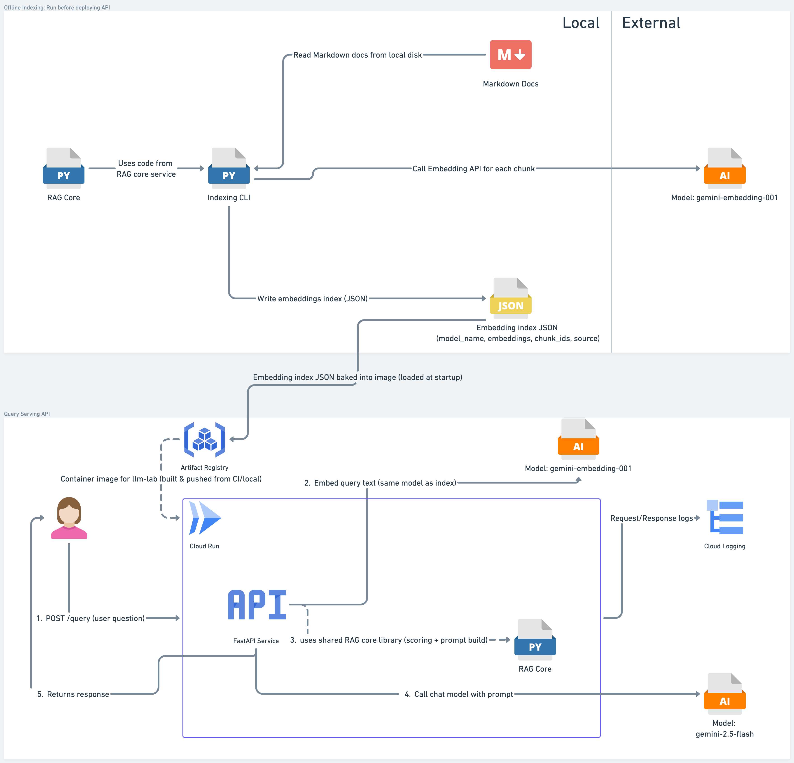

# LLM LAB RAG V1 Architecture

This document outlines the architecture of the Retrieval-Augmented Generation (RAG) V1 system implemented in LLM LAB. RAG V1 combines the capabilities of large language models (LLMs) with external knowledge sources to enhance the quality and relevance of generated responses.

## Table of Contents
- [Problem & Goals](#problem--goals)
  - [Problem](#problem)
  - [Goals](#goals)
  - [Non-goals](#non-goals)
- [High-Level Architecture](#high-level-architecture)
- [Components](#components)
  - [Offline Indexing(CLI)](#offline-indexingcli)
  - [RAG core](#rag-core)
  - [FastAPI Service](#fastapi-service)
  - [Dockerfile & Deployment](#dockerfile--deployment)
  - [LLM Provider Integration](#llm-provider-integration)
- [Request and Data Flow](#request-and-data-flow)
  - [Offline Indexing Flow](#offline-indexing-flow)
  - [Query Handling Flow](#query-handling-flow)
- [Observability](#observability)
  - [Logging](#logging)
  - [Monitoring](#monitoring)
- [Constraints & Limitations](#constraints--limitations)
- [Future Improvements](#future-improvements)

## Problem & Goals

### Problem

- I want to ask natural-language questions about a small set of my own technical notes (markdown files under `assets/docs/`) and get concise answers grounded in those notes.
- Calling an LLM directly doesn’t know about this corpus and can easily hallucinate or give generic answers; I need a way to inject my own content as context at query time.
- I also need a realistic, end-to-end RAG system that I can:
  - run locally,
  - deploy to the cloud,
  - and use as a learning + portfolio artifact for AI/LLM infrastructure work.

### Goals

**Functional**

- Expose a simple HTTP API (`POST /query`) that:
  - accepts a JSON payload with a natural-language `query` and a `top_k` parameter,
  - returns a JSON response containing an `answer` string and a `sources` list (document/chunk references used to answer).
- Use a small, local Markdown corpus in `assets/docs/` as the knowledge base.
- Perform basic semantic retrieval by:
  - embedding all chunks with a chosen embedding model,
  - embedding the user query at request time,
  - selecting the top-K most similar chunks via cosine similarity.

**Engineering / infra**

- Keep the system intentionally small and understandable:
  - one offline indexing CLI,
  - one RAG core module,
  - one FastAPI service,
  - one Docker image.
- Deploy to Google Cloud Run in `europe-west3` with:
  - the container image stored in Artifact Registry,
  - configuration via environment variables (API key, model names, etc.),
  - logs flowing into Cloud Logging,
  - basic metrics and a dashboard in Cloud Monitoring (request count, latency, error rate).
- Make it easy to run both locally and in the cloud with minimal manual steps (Docker run + env vars).

**Learning / proof-of-work**

- Practice writing production-shaped Python services: FastAPI, Pydantic models, error handling, logging, and tests.
- Practice core AI infra tasks:
  - embeddings,
  - simple retrieval,
  - prompt construction,
  - integrating with a hosted LLM API.
- Produce a concrete, end-to-end RAG v1 system that I can reference in future conversations (internal or external) as something I designed, implemented, and deployed.

### Non-goals

- High availability, multi-region redundancy, or strict SLOs; RAG v1 is a lab project, not a hardened production service.
- Multi-tenant or multi-project support; this version assumes a single, fixed corpus and a single configuration.
- Real-time ingestion or continuous indexing; documents are indexed offline and baked into the container image before deploy.
- Advanced retrieval techniques (vector databases, rerankers, hybrid lexical/semantic search); v1 deliberately uses in-memory embeddings + cosine similarity over a small index.
- Full security hardening; there is no authentication on the API yet, so it is not intended to be exposed to untrusted external traffic.


## High-Level Architecture

At a high level, RAG v1 consists of:

- An **offline indexing CLI** that reads Markdown docs (`assets/docs/*.md`), chunks them, and builds an embedding index into `assets/indexed_chunks.json`.
- A **Dockerized FastAPI service** that:
  - loads the precomputed index at startup,
  - exposes `/health`, `/echo`, and `/query`,
  - uses the same embedding model to embed incoming queries,
  - selects top-K chunks and calls an LLM to generate answers.
- A **Cloud Run deployment** in `europe-west3` using:
  - a container image stored in Artifact Registry,
  - environment variables for LLM configuration,
  - Cloud Logging and Cloud Monitoring for observability.

The high-level data flow looks like this:



## Components

### Offline Indexing(CLI)

- I provide an offline CLI command `index` implemented with Typer in `llm_lab.naive_rag`.
- The command reads Markdown documents from a configurable directory, which in v1 defaults to `assets/docs/`.
- For each `.md` file, I:
  - validate that the directory exists and that the file is not empty,
  - load the file as UTF-8 text,
  - split the content into chunks using blank lines (`"\n\n"`) as simple paragraph boundaries,
  - skip empty chunks and keep the original file path as the `source` field.
- Each chunk is represented as a small dataclass with:
  - `text`: the chunk content,
  - `source`: the path to the document it came from.
- I then call the embedding model (e.g. `gemini-embedding-001`) to embed each chunk:
  - I use the provider’s embedding API via `embed_content`,
  - embeddings are generated specifically for semantic similarity search.
- Indexed chunks are stored in a JSON file, which in v1 is `assets/indexed_chunks.json`.  
  The JSON structure includes:
  - a top-level `model_name` field indicating which embedding model was used,
  - a `created_at` timestamp,
  - a `chunks` array, where each item contains:
    - `text`
    - `source`
    - `embedding` (list of floats)
    - `chunk_id` (an integer id for traceability).
- On success, this JSON index is later baked into the Docker image and loaded at service startup.
- On failure (missing directory, empty file, invalid JSON, etc.) the CLI raises clear `ValueError`s so the calling code can surface a meaningful error to the user.
  
### RAG core

- The RAG core logic is implemented in a separate module (`llm_lab.rag_core`) so it can be reused by both:
  - the offline CLI (`naive_rag.py`), and
  - the FastAPI service (`/query` endpoint),
  without knowing anything about HTTP, FastAPI, or Cloud Run.

- It defines two dataclasses to represent chunks and their embeddings:
  - `Chunk` with `text` (chunk content) and `source` (path to the original document).
  - `IndexedChunk` which extends `Chunk` with:
    - `embedding`: a list of floats, and
    - `chunk_id`: an integer ID used for traceability in responses and logs.

- The `embed_text` function calls the embedding model to get a vector representation of a given text:
  - It takes a `genai.Client` instance, the input text, and the embedding model name.
  - It calls the provider’s `embed_content` API with a `SEMANTIC_SIMILARITY` task type.
  - It returns the first embedding vector as a list of floats.

- Similarity between embeddings is computed using cosine similarity:
  - The `cosine_similarity` function takes two float vectors and returns a similarity score between 0 and 1.
  - It validates that both vectors have the same length.
  - It guards against zero-length norms to avoid division-by-zero and returns `0.0` in that edge case.

- The `score_chunks` function is responsible for ranking chunks for a given query embedding:
  - It takes the query embedding, a list of `IndexedChunk` objects, and an optional `top_k`.
  - For each chunk it computes a cosine similarity score.
  - It sorts all `(score, chunk)` pairs in descending order and returns the top `k` chunks.

- The `build_prompt` function turns the top chunks into context for the LLM:
  - It takes the original user question and the selected `IndexedChunk` list.
  - It builds a prompt that lists the chosen chunks as “context”, including their `source` and `chunk_id`.
  - It instructs the model to answer **only** using that context.

- The `generate_response` function actually calls the LLM:
  - It takes a `genai.Client`, the chat model name, and the constructed prompt.
  - It calls the model’s `generateContent` API and returns the text of the response.

- LLM/API errors surface as exceptions (e.g. ClientError) which are handled by the CLI or FastAPI layer, not inside rag_core.

- In summary, the RAG core is responsible for:
  - representing chunks and embeddings,
  - embedding text,
  - scoring and selecting relevant chunks,
  - building the final prompt,
  - and calling the LLM.  
  It deliberately does **not** know about HTTP, FastAPI, or Cloud Run specifics; those are handled by the CLI and the API layer.


### FastAPI Service

- The FastAPI service is implemented in `llm_lab.main` and is designed to run on Google Cloud Run. It provides a RESTful API for querying the RAG system.
- The service exposes a simple `/health` endpoint for health checks, returning a 200 OK status with a JSON message.
- There is also an `/echo` endpoint that echoes back any JSON payload sent to it, useful for testing and debugging.
- The main functionality is provided by the `/query` endpoint, which accepts POST requests with a JSON containing:
  - a `query` field with the user query.
  - an optional `top_k` field to specify how many top chunks to consider (default is 3).
- Upon receiving a request, the service:
  - Validates the input using Pydantic models to ensure the `query` is a non-empty string and `top_k` is an integer in [1, 10].
  - Loads the precomputed indexed chunks from the baked-in JSON file (`assets/indexed_chunks.json`).
  - Embeds the user query using the same embedding model used during indexing.
  - Scores the indexed chunks against the query embedding to find the most relevant ones.
  - Builds a prompt using the top-ranked chunks.
  - Calls the LLM to generate a response based on the constructed prompt.
- The response is returned as a JSON object containing:
  - the generated `answer`,
  - the sources of the chunks used with their `chunk_id`s for traceability.
- The service takes in the following environment variables for configuration:
  - `LLM_API_KEY`: API key for the LLM provider.
  - `LLM_MODEL_NAME`: Name of the chat model to use (default: `gemini-2.5-flash`). It is an optional variable and falls back to `gemini-2.5-flash` if not set.
- I am using pydantic models for request validation and response serialization to ensure type safety and clear API contracts.
- The service handles errors gracefully, returning appropriate HTTP status codes and messages for invalid input or internal errors.
  - In case of LLM client errors, it returns a 502 Bad Gateway response with the error details.
  - For unexpected errors like ValueErrors, FileNotFoundErrors, it returns a 500 Internal Server Error with the error message.
  - Built-in body/schema errors return 422 from FastAPI; extra business-logic checks in my handler return 400 via CustomException.


### Dockerfile & Deployment

- The Dockerfile is designed to create a lightweight and efficient container image for deploying the RAG V1 service on Google Cloud Run.
- It uses the official Python 3.14 slim base image to minimize the image size while ensuring compatibility with the required Python packages.
- The Dockerfile performs the following steps:
  - Copies `uv` from the upstream image to use as the entrypoint for running the FastAPI application.
  - Creates a non-root user `llm_lab` for security best practices and switches to this user.
  - Sets the working directory to `/app`.
  - Installs packages required for building and running the application with `uv sync`.
  - Copies the application code and the precomputed indexed chunks JSON file into the container.
  - Runs a `uv uvicorn` command to start the FastAPI application, binding it to all interfaces on port 8080.
- I build the docker image locally and push it to Google Artifact Registry(created by Terraform).
- The service is then deployed to Google Cloud Run using Terraform, which manages the infrastructure as code and ensures consistent deployments.
- The Cloud Run service is configured to use the pushed Docker image, set environment variables for the LLM API key and model name, and allocate appropriate resources for handling requests.
- Upon deployment, the service is accessible via a public URL, allowing users to send queries and receive responses from the RAG V1 system.


### LLM Provider Integration

- The RAG V1 system integrates with a large language model (LLM) provider to perform both embedding and text generation tasks.
- The integration is handled through the `genai` Python client library, which provides a convenient interface for interacting with the LLM provider's API.
- The system uses two main functionalities from the LLM provider:
  - **Embedding Generation**: The `embed_content` method is used to generate vector embeddings for text chunks and user queries. The embeddings are created using a specified embedding model (e.g., `gemini-embedding-001`) and are optimized for semantic similarity search.
  - **Text Generation**: The `generateContent` method is used to generate responses based on the constructed prompts. The system uses a chat model (e.g., `gemini-2.5-flash`) to produce coherent and contextually relevant answers.
- The LLM client is initialized with an API key provided via environment variables, ensuring secure access to the LLM services.
- I call the LLM provider API when:
  - Embedding text chunks during the offline indexing process.
  - Embedding user queries during the query handling process.
  - Generating responses based on the constructed prompts that include relevant document context.


## Request and Data Flow

### Offline Indexing Flow

1. Indexing CLI is run (e.g. uv run python -m llm_lab.naive_rag index) with a valid LLM_API_KEY and embedding model configured via env vars.
2. The CLI reads Markdown files from the `assets/docs/` directory, splits them into chunks, and generates embeddings for each chunk using the specified embedding model.
3. The indexed chunks, along with their embeddings and metadata, are saved to a JSON file (`assets/indexed_chunks.json`).
4. This JSON file is then baked into the Docker image for use by the FastAPI service.

### Query Handling Flow

1. A user sends a POST request to the `/query` endpoint of the FastAPI service with a JSON payload containing the `query` and optional `top_k` parameters.
2. The service validates the input using Pydantic models to ensure the `query` is a non-empty string and `top_k` is a positive integer.
3. The service loads the precomputed indexed chunks from the baked-in JSON file (`assets/indexed_chunks.json`).
4. The user query is embedded using the same embedding model used during indexing.
5. The service computes similarity scores between the query embedding and each indexed chunk's embedding using cosine similarity.
6. The top `k` chunks with the highest similarity scores are selected.
7. A prompt is constructed that includes the user query and the selected chunks as context.
8. The prompt is sent to the LLM for response generation.
9. The generated answer, along with the sources of the chunks used, is returned as a JSON response to the user.
10.	The logging middleware records method, path, status code, duration, and error (if any) for the request into Cloud Logging.

## Observability

### Logging

- The FastAPI service adds a logging middleware that logs incoming requests and outgoing responses.
- Each log entry includes:
  - Timestamp
  - HTTP method
  - Request path
  - Response status code
  - Processing time
  - Error messages (if any)
- Logs are output to standard output in a structured format (JSON) for easy ingestion by logging systems.
- On cloud run, these logs can be viewed in Google Cloud Logging for monitoring and debugging purposes.
- Example (conceptual) log entry:
  ```JSON
  {"ts": "...", "method": "POST", "path": "/query", "status": 502, "duration_ms": 2100.5, "level": "ERROR", "error": "LLM client error: ..."}
  ```

### Monitoring

- The service can be monitored using Google Cloud Monitoring, which provides insights into performance metrics such as:
  - Request latency
  - Error rates
  - Request counts
- I created a simple dashboard with:
	•	total requests over time,
	•	p95 latency for /query,
	•	error rate.
- I used it to observe behavior under normal conditions and when rate-limited by the LLM provider.


## Constraints & Limitations

- The system currently supports only Markdown documents located in the `assets/docs` directory for indexing.
- The indexing process is offline and must be manually triggered via the CLI before deploying the service. Every content change requires re-running the indexer and rebuilding/redeploying the container, which couples content updates to the deployment pipeline.
- There is no authentication or authorization mechanism implemented for the API endpoints, making it unsuitable for production use without additional security measures.
- Since a free-tier LLM provider plan is used, the system may be subject to rate limiting and usage restrictions, which can impact performance and availability.
- The system does not implement advanced retrieval techniques such as dense passage retrieval or vector databases; it relies on simple cosine similarity for chunk selection.
- Error handling is basic, and more robust mechanisms may be needed for production scenarios.
- The system is designed for simplicity and cost-effectiveness, which may limit its scalability and robustness in high-demand environments.


## Future Improvements

- Implement real-time indexing and updating of documents to allow for dynamic knowledge bases.
- Add authentication and authorization mechanisms to secure the API endpoints.
- Explore advanced retrieval techniques and integrate with vector databases for improved chunk selection.
- Enhance error handling and implement retry mechanisms for LLM provider interactions.
- Multimodal support: Extend the system to handle different types of documents (e.g., PDFs, images) and incorporate multimodal embeddings.
- Extensive Load Testing: Conduct thorough load testing to evaluate performance under high traffic and optimize accordingly.
- Caching Mechanisms: Implement caching strategies for frequently asked queries to reduce latency and LLM usage.